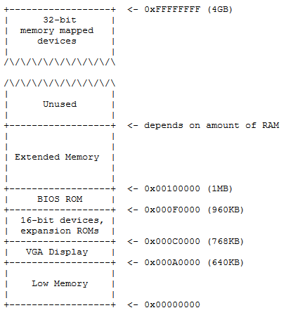

# Lab1-启动PC

[XV6 JOS代码](https://github.com/Ariesfish/mit-xv6-lab)

```bash
% mkdir 6.828
% cd 6.828
% git clone https://github.com/Ariesfish/mit-xv6-lab.git lab
% cd lab
```

## PC引导程序

### 从x86汇编语言开始

> **练习1**
>
> 熟悉x86汇编语言，注意Intel语法与Linux上使用的AT&T语法的差异

[PC Assembly Language Book](res/pcasm-book.pdf)

[Brennan's Guide to Inline Assembly](res/Inline-Assembly-with-DJGPP.pdf)

### 模拟x86

使用qemu模拟x86环境，利用gdb远程调试来学习引导过程

> 编译boot引导程序和kernel内核镜像

```bash
% cd lab
% make
+ as kern/entry.S
+ cc kern/entrypgdir.c
+ cc kern/init.c
+ cc kern/console.c
+ cc kern/monitor.c
+ cc kern/printf.c
+ cc kern/kdebug.c
+ cc lib/printfmt.c
+ cc lib/readline.c
+ cc lib/string.c
+ ld obj/kern/kernel
+ as boot/boot.S
+ cc -Os boot/main.c
+ ld boot/boot
boot block is 380 bytes (max 510)
+ mk obj/kern/kernel.img
```

注意: *如果出现 "undefined reference to `__udivdi3'" 之类的错误是由于未安装32-bit的gcc支持库*

> 启动QEMU

```bash
% make qemu # 带VGA显示界面，信息会同时显示在当前终端和QEMU的VGA显示界面
% make qemu-nox # 不带VGA显示界面
Booting from Hard Disk...
6828 decimal is XXX octal!
entering test_backtrace 5
entering test_backtrace 4
entering test_backtrace 3
entering test_backtrace 2
entering test_backtrace 1
entering test_backtrace 0
leaving test_backtrace 0
leaving test_backtrace 1
leaving test_backtrace 2
leaving test_backtrace 3
leaving test_backtrace 4
leaving test_backtrace 5
Welcome to the JOS kernel monitor!
Type 'help' for a list of commands.
K>
```

目前在 `K>` 提示符后仅可输入 `help` 和 `kerninfo` 两个命令查看信息，在终端按 `Ctrl+a x` 退出QEMU

```bash
K> help
help - Display this list of commands
kerninfo - Display information about the kernel
K> kerninfo
Special kernel symbols:
  _start                  0010000c (phys)
  entry  f010000c (virt)  0010000c (phys)
  etext  f01019e9 (virt)  f01019e9 (phys)
  edata  f0113060 (virt)  f0113060 (phys)
  end    f01136a0 (virt)  f01136a0 (phys)
Kernel executable memory footprint: 78KB
K>
```

### PC的物理地址空间



在最初的搭载16-bit Intel 8088 CPU的PC上，由于采用了20-bit的地址总线，所以能访问的最大物理地址空间为1M (2<sup>20</sup>)

### BIOS

> 首先在一个终端启动 qemu-gdb(或qemu-nox-gdb)

```bash
% make qemu-nox-gdb
```

> 然后在另一个终端启动GBD执行远程调试

```bash
% make gdb
gdb -n -x .gdbinit
GNU gdb (Ubuntu 8.1-0ubuntu3.2) 8.1.0.20180409-git
Copyright (C) 2018 Free Software Foundation, Inc.
License GPLv3+: GNU GPL version 3 or later <http://gnu.org/licenses/gpl.html>
This is free software: you are free to change and redistribute it.
There is NO WARRANTY, to the extent permitted by law.  Type "show copying"
and "show warranty" for details.
This GDB was configured as "x86_64-linux-gnu".
+ target remote localhost:26000
The target architecture is assumed to be i8086
[f000:fff0]    0xffff0:	ljmp   $0xf000,$0xe05b
0x0000fff0 in ?? ()
+ symbol-file obj/kern/kernel
(gdb)

```

加电启动时，首先进入16-bit 8086的实模式(real-mode)，在实模式采用了分段的技术将逻辑地址转换为20-bit的物理地址空间

其中CS(Code Segment)寄存器保存了段的基地址(如0xf000)，IP(Instruction Pointer)或者通俗一点PC(Program Count)寄存器保存了偏移地址(如0xfff0)。实际的物理地址采用 `CS:IP = CS << 4 + IP` 算法转换而成，所以 `0xf000:0xfff0` 指向的实际地址为 `0xffff0`

在8086的实模式下最高可访问的物理地址为 `0xfffff`

BIOS会被加载到1M地址空间的最后 `64K字节` `0xf0000 ~ 0xfffff`，这里加载后的第一条命令 `0xffff0: ljmp $0xf000,$0xe05b` 即是跳转到BIOS前部的 `0xfe05b` 处开始执行

> **练习2**
>
> 通过GDB的si(Step Instruction)单步执行命令查看BIOS的执行过程

BIOS会设置一个中断描述符表，初始化VGA显示界面和PCI总线等，最后它会寻找可启动的设备(软盘、硬盘、光驱等)，然后读取Boot Loader

## Boot Loader

BIOS将512个字节扇区(光驱的话是2048个字节)的 `Boot Loader` 加载到物理内存的 `0x7c00` 地址，[这里](https://www.glamenv-septzen.net/en/view/6)一篇文章讲述了魔数 `0x7c00` 的由来

`Boot Loader` 由一个汇编源文件 `boot/boot.S` 和一个C源文件 `boot/main.c` 组成。开始执行后首先会将 CPU 从实模式切换到 32-bit 的保护模式(protected mode) 以使用更大的内存地址空间

- cli (clear interrupt, disable interrupts)
- cld (clear direction flag, string operations increment)
  - df: 方向标志位。在串处理指令中，控制每次操作后si，di的增减(df=0，每次操作后si、di递增; df=1，每次操作后si、di递减)

**Note-1**: *80286扩展到24-bit地址总线，最大可访问16M的物理地址空间；80386之后采用32-bit地址总线，最大可访问4G的物理地址空间。它们采用了不同于8086的分段机制*

**Note-2**: *在80286之后的CPU上，为了防止实模式下地址回折的问题，设计了A20线的与门开关，boot/boot.S中可以看到进入保护模式前开启A20的操作*

**Note-3**: 关于 inb/outb IO端口指令, 操作的[外部设备](http://bochs.sourceforge.net/techspec/PORTS.LST)

> **练习3**
>
> 学习更多的GDB命令，在 `0x7c00` 处设置断点，结合 `boot/boot.S` 汇编代码和反汇编之后 `obj/boot/boot.asm` 跟踪 `boot loader` 的加载过程
>
> 然后继续跟踪 boot/main.c 中的 bootmain() 函数以及 readsect() 函数，了解kernel的剩余扇区是如何加载的

**回答下列问题:**

> At what point does the processor start executing 32-bit code? What exactly causes the switch from 16- to 32-bit mode?

- lgdt gdtdesc: 加载全局描述符表
- cr0: control register。cr0包含了6个预定义标志，第0位是保护允许位PE(Protedted Enable), 用于启动保护模式, 如果 PE=1 则保护模式启动, 如果 PE=0 则在实模式下运行。
- ljmp $PROT_MODE_CSEG, $protcseg

从 `.code32 protcseg:` 开始执行32-bit代码，在此之前通过设置 `GDT(lgdtw 0x7c64)` 和将 `CR0` 控制寄存器的保护模式Flag设为有效来完成16-bit到32-bit的切换，此时CPU工作在保护模式下

PROT_MODE_CSEG=0x8, 指定了CS段选择符, 指向GDT中的段描述符。

> What is the last instruction of the boot loader executed, and what is the first instruction of the kernel it just loaded?

bool loader最后执行的指令是 `call *0x10018`(0x10000 + 0x18: ELFHDR->e_entry)，kernel被加载后第一个执行的指令 `0x10000c: movw $0x1234,0x472`，加载之前会做一个entry地址的转换

> How does the boot loader decide how many sectors it must read in order to fetch the entire kernel from disk? Where does it find this information?

从 ELF头部中的 `ELFHDR + ELFHDR->e_phoff` 指向的 `Proghdr` 的 `p_memsz` 和 `p_offset` 中获得信息

### 加载内核

> **练习4**
>
> 学习C语言，特别是指针概念[pointer.c](res/pointers.c)

查看ELF文件各个section的信息

```bash
% objdump -h obj/kern/kernel
```

- .text: 程序的可执行代码
- .rodata: 只读数据，如字符串常量等
- .data: 已初始化的数据，如全局变量
- .bss: 存放未初始化的变量，但是ELF中只需要记录.bss的起始地址和长度，loader和程序必须自己将.bss段清零

查看程序头信息

```bash
% objdump -x obj/kern/kernel
```

- vaddr: 虚拟地址
- paddr: 物理地址
- memsz/filesz: 加载数据的大小

> **练习5**
>
> 在 `boot/Makefrag` 里 `-Ttext 0x7C00` 修改 boot loader 的加载地址，看看会发生什么

Boot loader会加载失败，最后产生 SIGTRAP 中断

> **练习6**
>
> 在 boot loader 加载后以及加载 Kernel 时查看 0x100000 地址有什么变化

一开始时是 0x0000, 在加载 kernel 后其中有了内容, 调试时用 `x/8x 0x100000` 查看内存内容

## 内核

### 位置相关的虚拟地址

